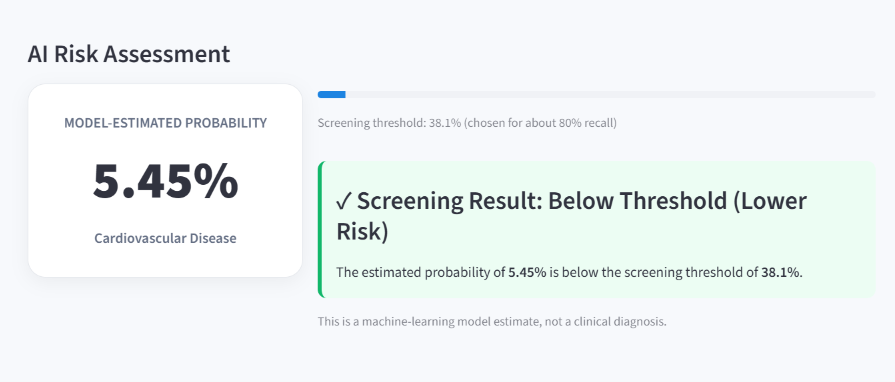
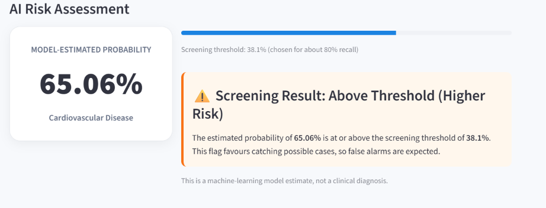
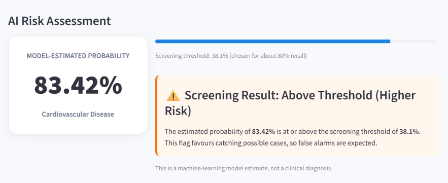

<div align="center">

# ❤️ CardioRisk AI

### Calibrated, explainable cardiovascular risk screening

**GIBC V2 · Track 02: Applied (Medical Technology)**


> ⚠️ **Research prototype. Not a medical diagnosis. Never used on real patients.**

</div>

---

## 📌 Overview

Most cardiovascular risk models stop at a single number. **CardioRisk AI** goes further: it turns 11 routine health measurements into a **calibrated probability**, applies a **screening threshold** designed to catch most cases, **explains every prediction**, and reports where the model is weak.

The whole workflow is reproducible: one notebook trains and evaluates the model and saves everything the Streamlit app needs. The app reads those files, so no metric or threshold is hardcoded.

## 🎯 The problem

| Problem | How CardioRisk AI addresses it |
|---|---|
| A risk score is given with no proof it is reliable | **Isotonic calibration**, so "80%" is checked against observed outcomes, plus a reliability diagram |
| Accuracy hides missed patients | **Screening threshold (0.381)** chosen for ~80% recall, with the false-alarm cost shown openly |
| Black-box predictions | **Per-patient SHAP-style contributions** showing what raised or lowered risk |
| Small model differences overstated | **5-fold CV and bootstrap confidence intervals** instead of declaring a winner |
| Averages hide weak spots | **Subgroup analysis** by gender code and age group |

## ✨ Features

- 🩺 **Risk Assessment:** enter 11 inputs, get a probability, a screening flag and a "Why this prediction?" chart
- ⚡ **One-click demo profiles** (low, moderate, high risk); every field stays editable
- 🛡️ **Input validation:** ages, body measurements and blood pressure are limited to the ranges seen in training; systolic must exceed diastolic
- 📊 **Model Analytics:** test metrics, ROC and precision-recall curves, interactive threshold slider with live confusion matrix, cross-validation, bootstrap CIs, calibration, subgroups
- 🧠 **Explainability:** global feature importance with one-hot columns grouped back to their original feature
- 🔬 **Methodology** and ⚠️ **Responsible AI** pages inside the app

## 📷 Screenshots

| Low-risk example | Moderate-risk example | High-risk example |
|---|---|---|
|  |  |  |

## 📈 Results

Evaluated on a held-out, stratified 20% test set that was never used for tuning or threshold selection.

**Deployed model: XGBoost (tuned) + isotonic calibration, screening threshold 0.381**

| Accuracy | Precision | Recall | Specificity | ROC-AUC | PR-AUC |
|---|---|---|---|---|---|
| 72.10% | 68.60% | 80.42% | 63.96% | 80.64% | 78.51% |

**Model comparison at the default 0.50 threshold**

| Model | Accuracy | Precision | Recall | F1 | ROC-AUC | PR-AUC |
|---|---|---|---|---|---|---|
| Logistic Regression | 72.92 | 75.75 | 66.59 | 70.87 | 79.60 | 77.39 |
| Random Forest | 73.37 | 74.40 | 70.39 | 72.34 | 79.61 | 77.75 |
| XGBoost | 73.79 | 75.54 | 69.53 | 72.41 | 80.56 | 78.53 |
| XGBoost (tuned) | 73.65 | 75.72 | 68.80 | 72.09 | 80.63 | 78.54 |

**How to read this.** All four models land within about one point of ROC-AUC, so the app reports confidence intervals rather than crowning a winner. Lowering the threshold from 0.50 to 0.381 raises recall to about 80% and lowers precision: catching more possible cases means more false alarms. That trade-off is deliberate for a screening tool and is shown explicitly in the app.

### Example predictions from the demo profiles

| Profile | Inputs (summary) | Estimated probability | Screening flag |
|---|---|---|---|
| Low-risk | 35 y, BP 110/70, normal cholesterol and glucose, non-smoker, active | 5.45% | Below threshold |
| Moderate-risk | 52 y, BP 130/85, cholesterol above normal, inactive | 65.06% | Above threshold |
| High-risk | 62 y, BP 165/100, high cholesterol and glucose, smoker, inactive | 83.42% | Above threshold |

## 🔬 Methodology

```
Raw dataset (70,000 records)
   │
   ▼  Data cleaning  →  remove impossible blood pressure, height, weight
   ▼  Feature engineering  →  age in years (30–65)
   ▼  Stratified 80/20 train/test split
   ▼  Preprocessing pipeline  →  StandardScaler + OneHotEncoder
   │
   ├── Logistic Regression
   ├── Random Forest
   └── XGBoost ── randomized search (3-fold CV, ROC-AUC, training set only)
            │
            ▼  5-fold cross-validation · bootstrap confidence intervals
            ▼  Isotonic calibration (kept only if it lowers Brier score)
            ▼  Screening threshold (out-of-fold, target recall 80%)
            ▼  SHAP-style contributions · subgroup analysis
            ▼  Saved to models/  →  Streamlit app
```

**Cleaning rules:** systolic 70–250, diastolic 40–150 and systolic > diastolic; height 100–250 cm; weight 30–200 kg.

**Design choices worth noting**
- `age_group` is **not** a model input; it is derived from age and used only for exploration and subgroup analysis, avoiding redundant features.
- The threshold is derived from **out-of-fold training predictions**, so the test set stays untouched.
- The tuned XGBoost is used **only if** it beats the default on the same CV folds; calibration is used **only if** it improves Brier score.
- The app **rejects inputs outside the training range** instead of extrapolating.

## 🗂️ Project structure

```
cardio-risk-ai/
├── app.py                                  # Streamlit application
├── Cardiovascular_Disease_data_analysis.ipynb   # EDA, training, evaluation
├── requirements.txt
├── README.md
├── assets/                                 # screenshots used in this README
└── models/                                 # written by the notebook, read by the app
    ├── cardiorisk_xgboost_pipeline.joblib  # deployed model
    ├── model_metadata.json                 # threshold, features, input ranges
    ├── model_metrics.json                  # CV, bootstrap, calibration, subgroups
    └── test_predictions.npz                # test-set probabilities for the curves
```

## 🚀 Setup and run

**Prerequisites:** Python 3.10+ and `git`.

```bash
# 1. Clone
git clone https://github.com/aimanbabar047-hash/cardio-risk-ai.git
cd cardio-risk-ai

# 2. Create a virtual environment
python -m venv .venv
source .venv/bin/activate          # Windows: .venv\Scripts\activate

# 3. Install dependencies
pip install -r requirements.txt

# 4. Run the app
streamlit run app.py
```

The app opens at `http://localhost:8501`. The trained model is included in `models/`, so no training is needed to try it.

### Using the app
1. Open **Risk Assessment** and click a demo profile (or type your own values).
2. Click **ANALYZE CARDIOVASCULAR RISK**.
3. Read the probability, the screening flag and the "Why this prediction?" chart.
4. Explore **Model Analytics** to see the threshold trade-off, calibration and subgroup results.

### Retraining from scratch (optional)
Open the notebook and run all cells. It downloads the dataset with `kagglehub`, trains and evaluates all models and regenerates everything in `models/`. Use the same `scikit-learn` and `xgboost` versions recorded in `models/model_metadata.json` if you want to reuse the saved model file elsewhere.

## ⚠️ Limitations and responsible use

- Trained on a **public dataset**, not prospectively collected clinical data; **no clinical validation**.
- Trained on adults aged **30–65** only; other ages are rejected.
- The screening threshold favours recall, so **false alarms are expected** (precision is 68.6% at the deployed threshold).
- Differences between the compared models are small; see the confidence intervals in the app.
- Performance may differ between subgroups; check the Subgroups tab.
- The dataset **does not document which gender code is female or male**, so the app shows raw codes instead of guessing.
- Feature importance and SHAP-style values describe model behaviour and do **not** prove biological causation.
- Intended for research, education and demonstration only. It must not replace professional medical evaluation.

## 🧰 Built with

Python · Streamlit · scikit-learn · XGBoost · pandas · NumPy · joblib · Kaggle dataset ([Cardiovascular Disease dataset](https://www.kaggle.com/datasets/sulianova/cardiovascular-disease-dataset) by Svetlana Ulianova)

## 👤 Author

**Aiman Babar** (solo participant), [@aimanbabar047-hash](https://github.com/aimanbabar047-hash)

Built for **Global Innovation Build Challenge (GIBC) V2**, Track 02: Applied.
